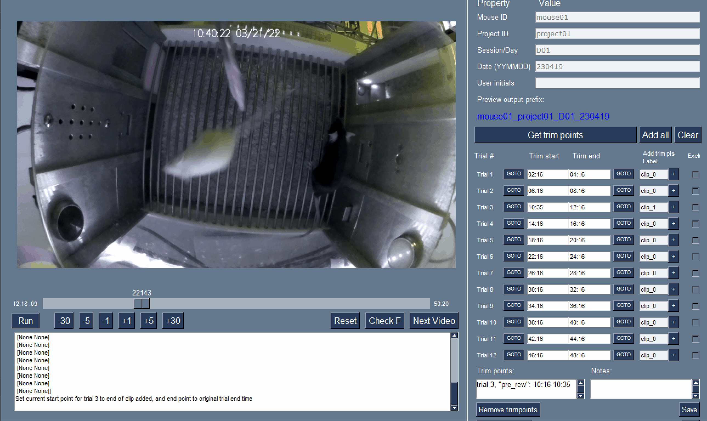

Welcome to the Basic Trimmer's
===================================

The **Basic Trimmer** is a tool to aid the use of Simple Behavioral Analysis (SimBA) through data preparation. 

A major technical limitation in the study of complex social behavior of freely moving rodents is the bottleneck caused by manual annotation of behavior. Behavioral annotation can be subjective, extremely time-intensive, and prone to observer drift. `Simple Behavioral Analysis (SimBA) <https://goldenneurolab.com/simba/>`_, an open-source package, uses machine learning (ML) approaches to automate behavioral predictions through the combination of pose estimation and supervised ML. 
Individual experiments often incorporate thousands of video recordings, all of which need to be preprocessed and maintained; this includes locating individual experimental trials, identifying behavioral events within each trial, and choosing trimming points to focus on specific behavioral epochs. Manual preprocessing and project management requires unfeasible effort, often yielding video datasets with inaccuracies in timing or content, leading to inaccurate ML predictive classifications. 

The Basic Trimmer allows the user to navigate through all of the start/end points that they would like to trim and handles the trimming process for them.

Contents
--------
.. toctree::
   installation
   usage
