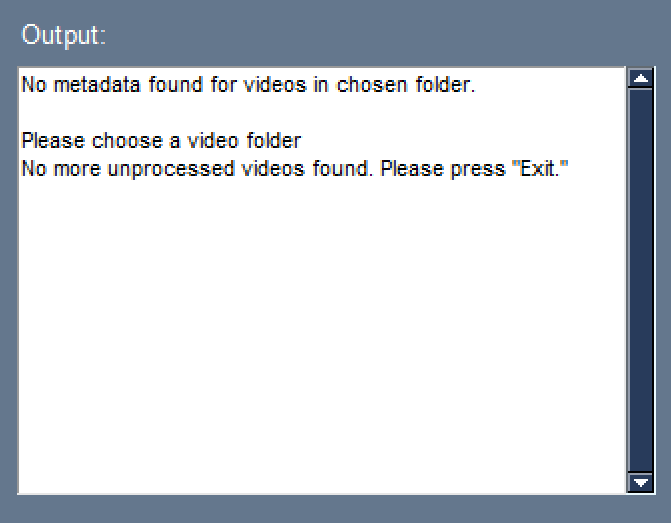

Tips and Tricks
==============

1) If your video is too large - use the resize button!

+----------------------------------------------+--------------------------------------+
| Before                                       | After                                | 
+==============================================+======================================+
|.. image:: images/resize_before.png           |.. image:: images/video_loaded.png    |
|  :width: 500                                 |  :width: 500                         |
+----------------------------------------------+--------------------------------------+

2) Unsure of the error? Refer to the Output Log: 

In this example, a folder that did not contain any videos was selected

.. autosummary::
   :toctree: generated

   Basic Trimmer
