Usage
=====

.. _installation:

Installation
------------

To use the Basic Trimmer, first install it through ?:

.. code-block:: console

   l8ter

The Process
------------
The Basic Trimmer is split into two portions - Part 1: Getting the Trim Points and Part 2: Trimming the Videos.

In Part One, you will navigate through your video and select the specific points that you would like to trim. You will also be able to type in a label for these clips that will correspond to what the clip will be named after being trimmer. This part will output a metadata file containing all of data that you just collected (trimming start/end points, labels). This file will then be used in part 2.

In Part Two, the metadata will be taken in along with the video and the trimmed clips will be saved.

Part 1: Getting the Trim Points
----------------
Step 1. Run "basic_trimmer.py". When the GUI opens up, it should look like the following: 
"""""""""""

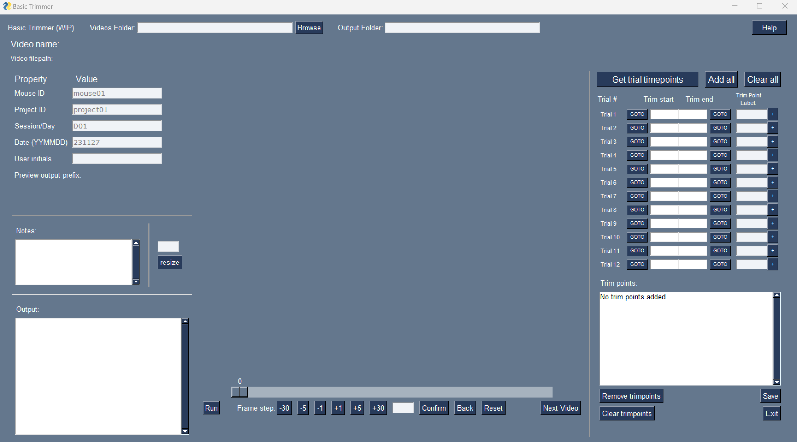

Step 2: Navigate to the folder holding the videos to trim.
"""""""""""

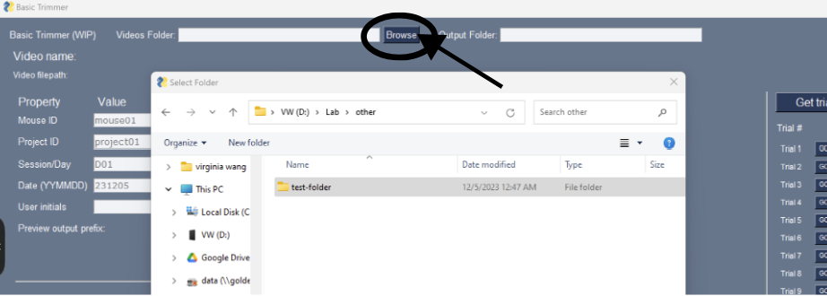

Step 3. Click "Next Video" to load in the first video you are going to trim. 
"""""""""""

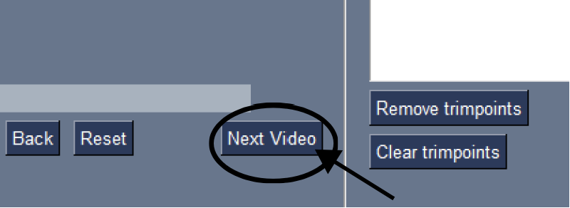

Your screen should look like the following

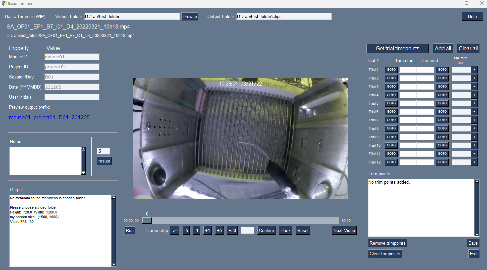

Step 4. Click to change these properties. 
"""""""""""
Change the properties of the video by clicking on each box and typing in the appropriate information
::

   These properties will be used to name the output of this script (the metadata). 
   The "Preview output prefix" shows what the file name will look like. As shown, all but “User Initials” will be used.
   However, the user initials will be saved in the metadata file so that, if needed, the person who edited the file can be found.

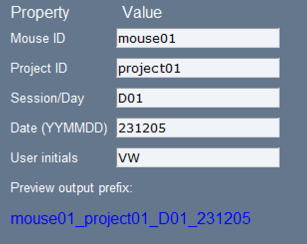

Step 5: Navigate to first trial 
"""""""""""

Using the scroll bar, as well as the frame jump buttons, navigate to the start of your first trial 

.. image:: images/Findingfirstframe.gif
  :width: 700

Step 6: Click "Get trim points" 
"""""""""""

::

   Starting from your current frame, the script will load 2-minute trials separated by 2 minute intervals.
   This should correspond with the start/end of the trials in your video

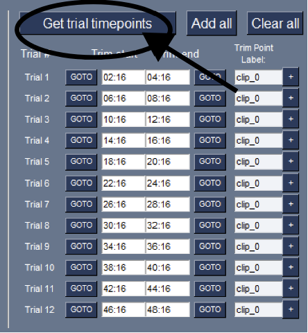

Step 7 - Step (a lot probably): Adding Trim Points
"""""""""""

a) Click "GOTO" to jump to the appropriate "Trim Start" point
b) Scroll/use frame buttons until you find the end frame of interest. In this example, it is when the reward is introduced. The trial starts (as seen above) at 10:16. The end frame of interest occurs at 10:54

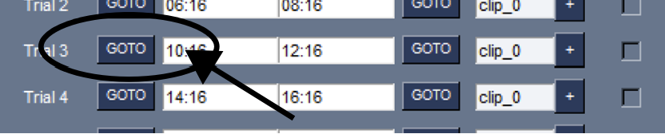

c) Once you have navigated to the ending frame of that trial, Click the appropriate “Trim end” white box. Your current frame timestamp will replace the previous one

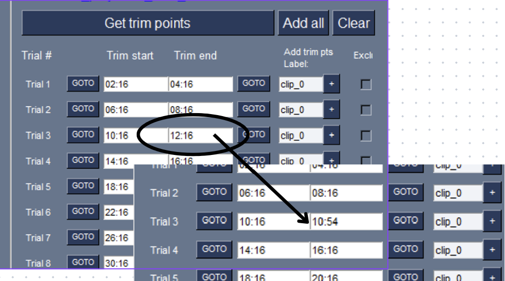

d) Click the appropriate “Add trim pts Label” to type in your label

::

   These labels will be used to name the clips once they are saved. 
   For example, if you are clipping a portion of trial 3 from 10:16 - 10:35 and typed in the label "pre_rew", 
   then the subsequent trimmed clip may be saved as "mouse01_D01_t03_pre_rew"

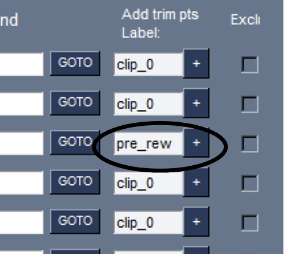

e) Click the “+” button to add the trim point to the list at the bottom. 

::

Notice that the current frame moves from the end to the start, and that the end now has the original ending point. This is so that the next trim point can be found after this clip. 

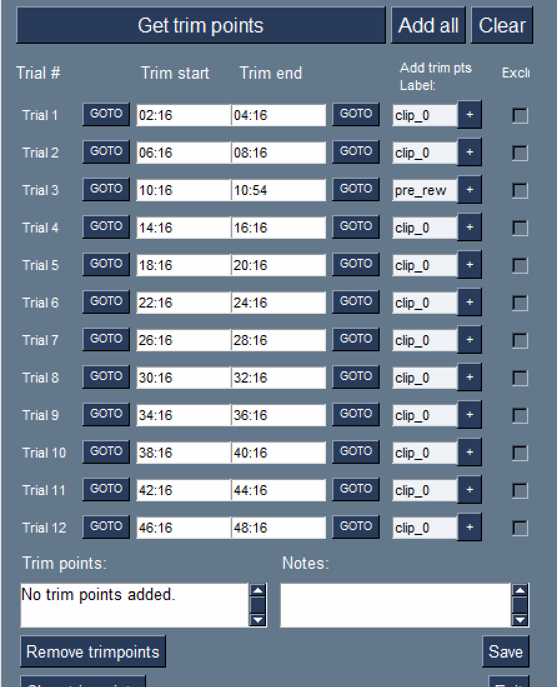

f) To record the start time of the next clip, navigate to the desired starting frame using the scroller/buttons and then click the appropriate “Trim start” white box.

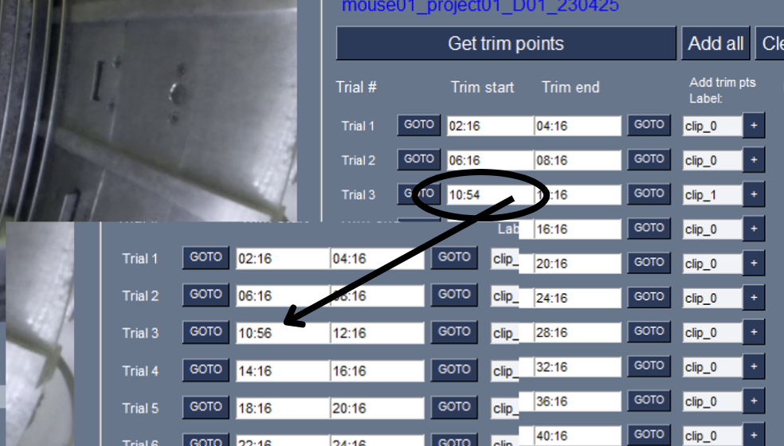

g) Repeat this process as needed within a trial. If all the time is used (trim start > trim end), then the text will appear red

**Put together, here is how to add a trim point**

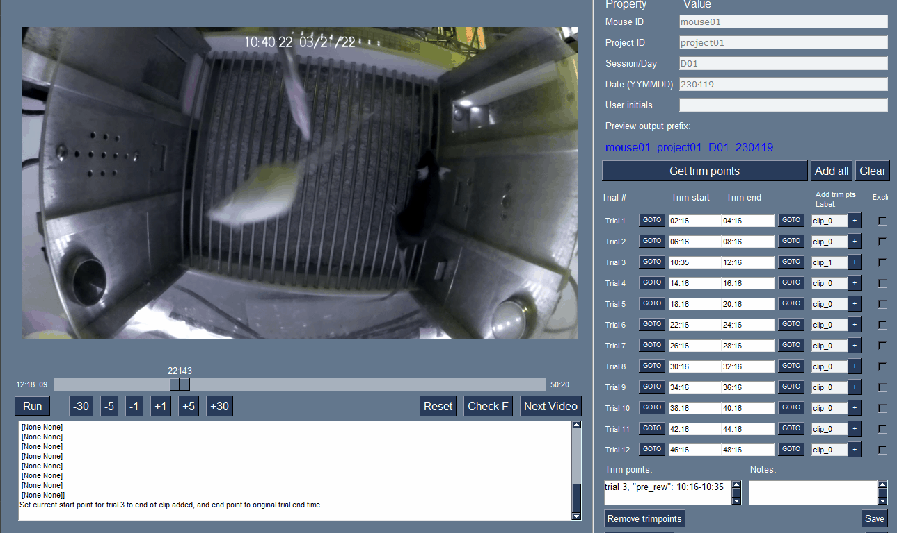
